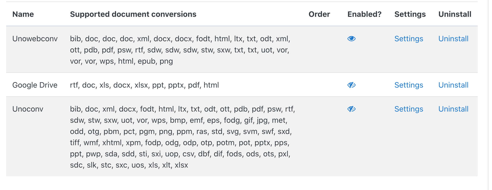

# Moodle unowebconv plugin

This Repository contains the code for the `unowebconv` plugin, an alternative to the unoconv moodle plugin, that uses a webservice for the document conversions.

## Content

1. [How to use](#how-to-use)
2. [Adjustments](#adjustments)
3. [Compatibility](#compatibility)
4. [Troubleshooting](#troubleshooting)
5. [Changes](#Changes)

## How to use

To install this plugin in moodle there are two ways:

1. Install the plugin from zip (recommended)
   _Important:_ only create a zip from the unowebconv folder (e.g. `unowebconv.zip`)

2. Copy the folder `unowebconv` and its contents to `files/converter/` within the moodle installation and run a database upgrade.

After the plugin was installed sucessfully, do not forget to provide a path pointing to the corresponding webservice, after that the plugin is enabled and ready to use.

## Adjustments

Currently while the document conversion is ongoing Moodle will show a gray area with a "Generating the PDF..." label. Since this plugin does conversions using a webservice it might be a good idea to let the user know that the conversion process could take a few minutes.

To change this label, within your moodle installation you can change

```php
// Default value for lang/en/assignfeedback_editpdf.php
$string['generatingpdf'] = 'Generating PDF ...';

// Change to new value
$string['generatingpdf'] = 'Generating PDF. This could take a few minutes';
```

The above example comes from an english moodle installation where the language strings are stored alongside the plugin in `mod/assign/feedback/editpdf/lang/en/assignfeedback_editpdf.php`.

If you want to change this label for another language, you can edit the string template (`$string['generatingpdf']`) in `lang/<YOUR_LANGUAGE>/assignfeedback_editpdf.php`. The location of this folder depends on the way you installed the language pack.

### Language pack location

If the language pack was installed using the GUI it will be stored in your `moodledata` directory, e.g. `moodledata/lang/de/` will contain the translations for german moodle.
In case the language packs were installed by downloading the corresponding pack as `.zip` file, its unzipped contents are stored in `moodle/lang/<YOUR_LANGUAGE>/`.

## Compatibility

The current version of this [plugin](https://github.com/team-parallax/unowebconv-plugin) (v1.0.2) works with version `0.4.2` of the unoconv-webservice (more information on versions below).

All versions currently mentioned in this document specify versions of the plugin itself or versions of the [team-parallax/unoconv-webservice](https://github.com/team-parallax/unoconv-webservice) (referred to as unoconv-webservice)


| Plugin | Webservice |
| --- | --- |
| 1.0.0 | 0.4.2 |
| 1.0.1 | 0.4.2 |
| 1.0.2 | 0.4.2 |
| 1.1.0 | 0.5.2 |

## Troubleshooting

In case the plugin is not working properly verify the following things:

1. You correctly [installed](#how-to-use) the plugin
2. Review your webservice url

### Moodle settings overview

The `Unowebconv` settings:


To set a (new) url for the `unoconv-webservice` enter a valid url into the text field, then save it.

To test if everything works as expected click on 'Test unoconv webservice url'.

You will see:


if the url you entered points to an instance of the `unoconv-webservice`.
In case of an error you will be displayed the following


The image below shows the settings of Moodles document converters admin settings, with correctly installed and configured Plugins.



If the column __Supported document conversions__ is empty after the installation, verify that the provided webservice url is correct and the service is running.


## Changes

Changes in different versions:

__1.0.0__: release candidate

__1.0.1__: updated labels for settings page, automatic disabling of unoconv

__1.0.2__: enable plugin after installation without checking webservice url

__1.1.0__: updates documentation for settings.
Adds better feedback for webservice url setting.
